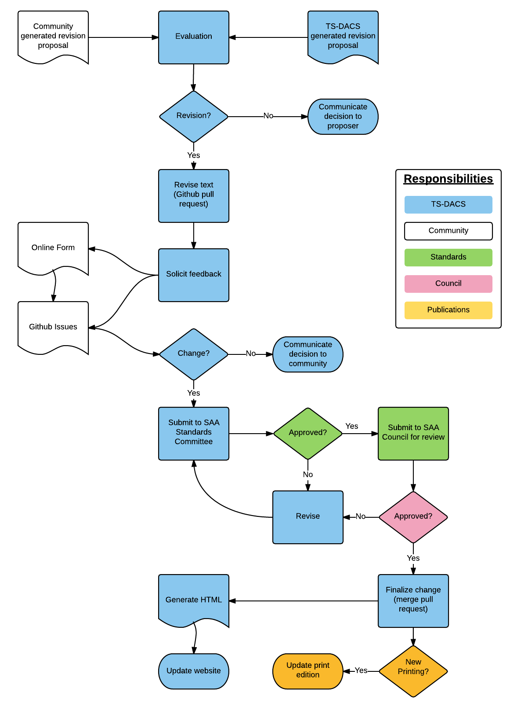

# DACS (Describing Archives: A Content Standard)

This site is maintained to facilitate an open and transparent revision process of DACS and to document a record of all changes made to the standard. The site includes the full text of the standard and a record of all proposed and accepted revisions since March 2016.

DACS is an output-neutral set of rules for describing archives, personal papers, and manuscript collections, and can be applied to all material types. DACS is compatible with ISAD(G): General International Standard Archival Description, 2nd ed. (International Council on Archives, 1999) and ISAAR(CPF): International Standard Archival Authority Records for Corporate Bodies, Persons and Families, 2nd ed. (International Council on Archives, 2003).

## Converting to other formats

The documentation on this site is written in Markdown.  To convert to other formats, you can use the command-line application [Pandoc](http://pandoc.org), which works on all operating systems. Pandoc can be downloaded [from their website](http://pandoc.org/installing.html) or [from Github](https://github.com/jgm/pandoc/releases).

Common commands:
In general, the command is formatted `pandoc FiletoConvert -o FileNameforResult`

  _Markdown to HTML:_  
  `pandoc pandoc-example.markdown -o pandoc-example.html`

  _Markdown to DOCX:_  
  `pandoc pandoc-example.markdown -o pandoc-example.docx`

  _Markdown to PDF:_  
  `pandoc pandoc-example.markdown -o pandoc-example.pdf`

## Revision Process

The revision process begins when a formal proposal is submitted to TS-DACS from the community or a TS-DACS member.  Proposals should include the following:

  * Brief description of the component of DACS to be changed as well as the proposed change.
  * Justification for the proposed change. The justification must include why the proposed change to DACS is beneficial to the American  archival profession.
  * Impact of the proposed change.

TS-DACS will also monitor changes to companion standards and evaluate whether DACS also needs revision to remain compatible. Companion standards include, but are not limited to, EAD, EAC, RDA, MARC, and DCRM.

### Revision Procedures

  1. TS-DACS receives and reviews a proposal. If a revision is warranted, TS-DACS makes the proposal, including the revised text,   widely available to the community for feedback. Feedback is collected on Github.

  2. TS-DACS evaluates the community feedback and decides if the revision should proceed. If yes, TS-DACS updates the proposed revision based on the community feedback and submits it to the Standards Committee for approval.

  3. After receiving Standards Committee approval, TS-DACS submits the revision to SAA Council for final approval.

  4. DACS is updated with the revised text on Github and the SAA website, and in publications if necessary.

  5. TS-DACS notifies community of the revision through listservs.

###Using Github to track revisions
TS-DACS began using Github in March 2016 to manage and document the revision process. Revisions are tracked in Github with the following procedure:

  1. Create Github pull request with the proposed revision, including the justification and impact statements.

  2. Collect community feedback on the pull request, either through an online form that creates Github issues or directly as Github issues.

  3. Once the revision is approved, merge the pull request.

  4. Generate HTML of the revised DACS for SAA’s website.

###Getting started with Github
There are multiple ways you can interact with Github to propose a revision, including using their [desktop application](https://guides.github.com/activities/forking/) or [the command line](http://kbroman.org/github_tutorial/pages/fork.html). The instructions below show you how to do it staying in [the web interface](https://help.github.com/articles/github-flow-in-the-browser/).

 1. Create a [Github account](https://github.com/join).
 
 2. Make a copy of the DACS repository to work on, which is called "creating a fork."
 
      a. Log in  to your Github account.
      
      b. Go to the [DACS repository](https://github.com/saa-ts-dacs/dacs).

      c. Click "Fork" in the upper right.

 3. Make the changes in your copy of the repository.

      a. In your copy, [create a branch](https://help.github.com/articles/creating-and-deleting-branches-within-your-repository/) to make the changes in.

      b. To edit, click on a document and then click the pencil icon in the upper right. This will give you a text editor. Formatting can be added using the [markdown syntax](https://daringfireball.net/projects/markdown/).

      c. When the editing is complete, give the edit a title and description in the Commit changes box, which is below the editing screen. Commit the change directly to your new branch.
 
 4. Suggest your changes to the DACS repository, which is called a "[pull request](https://help.github.com/articles/using-pull-requests/)".
 
      a. Select your branch and click "New pull request."

      b. Give the request a title that explains the change. In the description, including your justification for the change and its impact.

      c. Click "Create pull request" which will alert TS-DACS that your change has been suggested.

## Authors

This content is maintained by the Society of American Archivists' Technical Subcommittee on _Describing Archives: A Content Standard_ (TS-DACS)

## License

CC-BY
